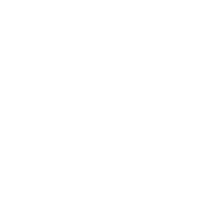
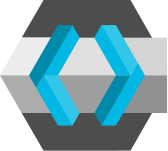

# Hi there 👋 I'm Caleb

🚀 **Software Engineer** with 3 years of professional industry experience, startup experience and over 17 years formal and independent technical study, a B.S. in Computer Information Technology, and Minor in Computer Forensics. Expertise working on data intensive applications on agile engineering teams.

## 🔧 Tech Stack

  <section>
      <!-- Languages -->
      
      
      
      
      
      
      
  </section>

  <section>
      <!-- Frameworks -->
      
      
      
      
      
      
      
  </section>

  <section>
      <!-- Databases -->
      
      
      
      
  </section>

  <section>
      <!-- Cloud / Infra -->
      
        
      
        
      
      
  </section>

## 📌 Featured Projects

- **[Periodic Table Explorer](https://github.com/calebd-anderson/open-chemistry-lab-backend)**  
  Interactive periodic table web app built with Angular + Spring Boot + MongoDB, featuring JWT-based authentication and complete admin user management.  
  

## 

✨ _“I build software that scales — from high-performance pipelines to secure authentication systems — always with a focus on reliability and clean architecture.”_
